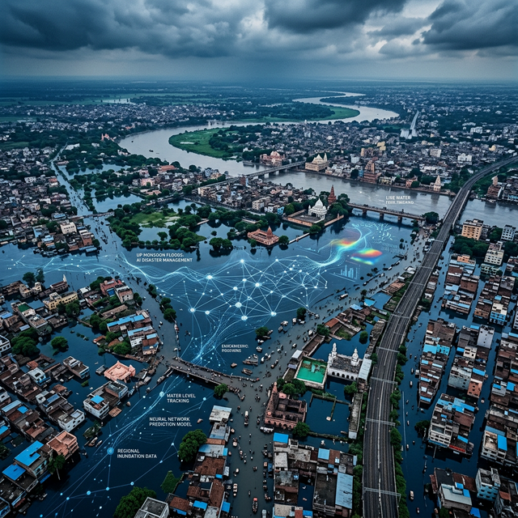
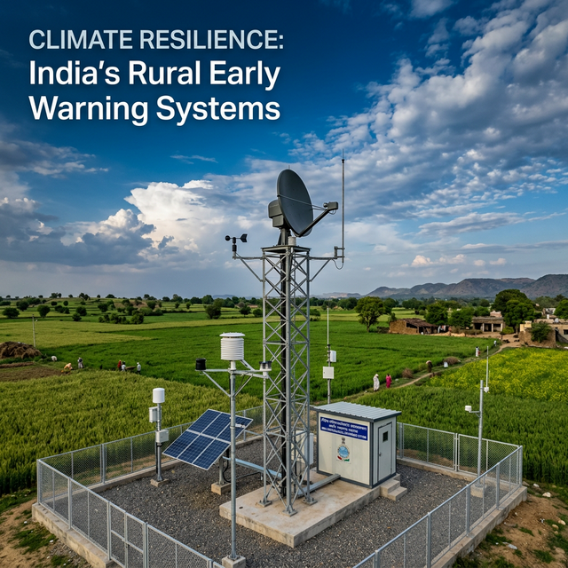

<div align="center">
  <div style="background:#0a3d62;border-radius:12px;padding:28px 20px;">
    <h1 style="color:#eef7ff;margin:0;">FloodCast</h1>
    <p style="color:#9ec9e8;margin:8px 0 0;">Operational streamflow forecasting for Uttar Pradesh — 367 river gauges, one live picture</p>
  </div>
  <p>
    <a href="https://floodcast-backend-vx1j.onrender.com/stations"></a>
    
    
    
  </p>
</div>



## What this is

FloodCast turns fragmented river-monitoring data into a single operational view: how much water
is moving through every major gauge in Uttar Pradesh, how that compares to historical flood
thresholds, and what the next 7 days look like. It is built for people who have to make calls
before the water arrives — district officers, infrastructure operators, and response teams.

## Features

**Live gauge network.** 367 monitoring stations across the state on an interactive map, each
colored by live risk status — NORMAL, WATCH, WARNING, DANGER, EXTREME — computed against
that gauge's own return-period thresholds (2/5/15/20-year), not a one-size-fits-all number.

**14-day streamflow trajectories.** Every station shows observed recent flows chained into a
7-day hybrid-model forecast, plotted against its flood thresholds so exceedances are visible
at a glance.

**District briefings in one click.** Batch-predict a whole district (or the full state) and get
an auto-written briefing: peak station, peak flow versus thresholds, severity counts, the
rainiest window, and a recommended action — ready to copy or download. No CSV merging, no
hand-written summaries.

**Versioned, traceable forecasts.** Every prediction carries its model version, source-data
date, and generation ID, so any number on screen can be traced back to exactly what produced it.

**Fresh data pipeline.** River states anchor nightly to the latest published GloFAS run with
automatic fallback, rainfall refreshes in rate-limit-safe batches, and every ingest passes
validation (threshold ordering, geographic bounds, physical ranges) before it touches the database.

**Quality flags.** Silent stations, out-of-range values, and neighbor-spike anomalies are flagged
in the database, and forecasts that hit physical limits are clamped rather than stored.

**Alert delivery.** DANGER and EXTREME forecasts can push to a response-group chat automatically.

## From research to operations

The model behind the dashboard comes from a full research program, kept disciplined enough to trust:

- **Sources unified:** Google Flood Hub gauge archive, HydroATLAS basin parameters, GloFAS
  reanalysis, gridded rainfall, and live Open-Meteo — resolved to one station master with a
  documented audit trail.
- **Panel:** 3,213,819 daily records (367 gauges × 8,757 days, 2000–2023) with physics-aware
  features — routing lags, antecedent moisture, monsoon seasonality, return-period exceedance.
- **Leak discipline:** all scalers fit on the chronological train split only; no shuffled
  cross-validation near time series.
- **Model:** 2-layer LSTM over 15-day windows plus an XGBoost residual corrector on basin
  geography. Held-out test: MAE 0.049, RMSE 0.315, NSE 0.924 (LSTM-only baseline NSE 0.535).

## Tech stack

| Layer | Technology |
|---|---|
| Model | PyTorch (LSTM) + XGBoost, scikit-learn scaling, xarray/zarr ingestion |
| API | FastAPI + Pydantic, SQLite (WAL), APScheduler |
| Web | React 18 + TypeScript + Vite, Tailwind, Leaflet maps, Recharts |
| Deploy | Render (API) + Vercel (site), nightly anchor pipeline |

## API

| Method | Endpoint | Description |
|---|---|---|
| GET | `/stations` | All monitoring stations |
| GET | `/station/{id}` | Statics, thresholds, recent flows |
| POST | `/predict` | Streamflow forecast (`station_id`, `date`, optional rainfall override) |
| POST | `/api/admin/alert-webhook` | DANGER/EXTREME push notification |

Example:

```bash
curl -X POST "https://floodcast-backend-vx1j.onrender.com/predict" \
  -H "Content-Type: application/json" \
  -d '{"station_id": 0, "date": "2026-09-23"}'
```

```json
{
  "station_id": 0,
  "date": "2026-09-23",
  "pred_raw_streamflow": 0.0,
  "anchor_streamflow": 0.19,
  "model_version": "hybrid-lstm-xgb-32d-256h-835c1591",
  "db_date": "2026-09-23",
  "generation_id": "63b7b4f490ac",
  "unit": "m³/s"
}
```



## In progress

Prediction intervals from held-out residuals, what-if rainfall scenarios, and per-user alert
subscriptions — each designed against the same rule as everything above: additive, versioned,
and removable without touching the core.

---
Built for the Climate Resilience Observatory (CRO), Uttar Pradesh.
